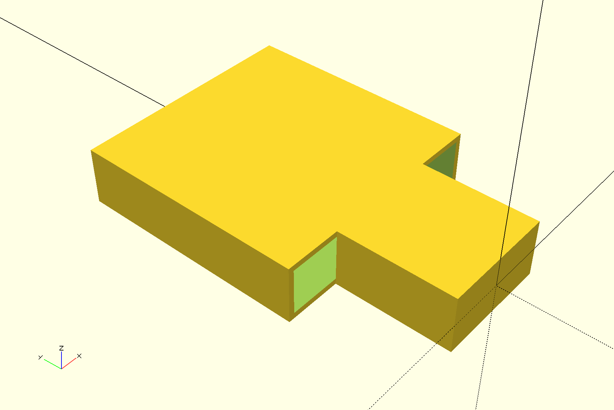
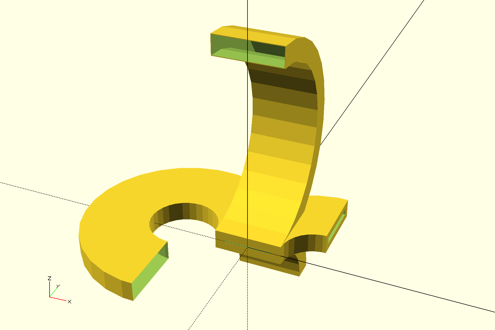
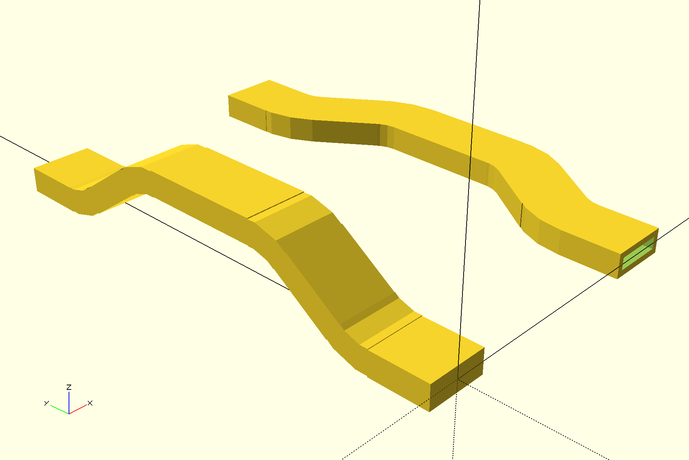
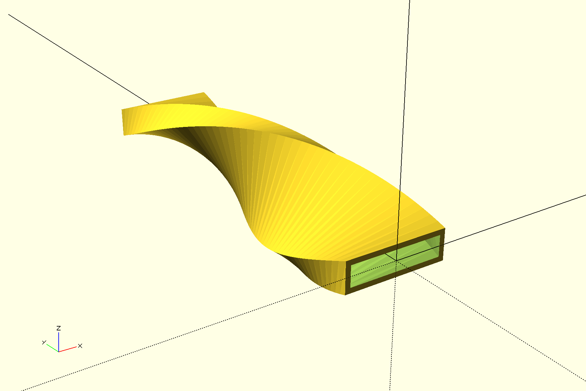
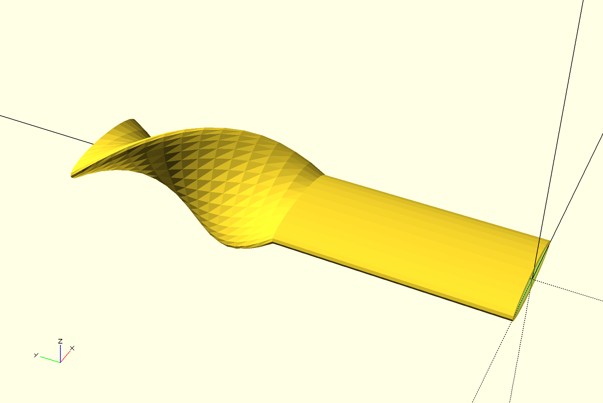
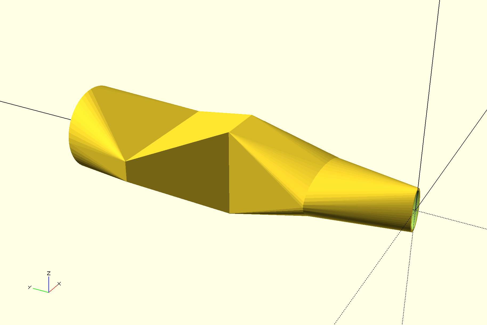

# segment-scad

Tools to create parametrable and linkable segments in [OpenScad](http://www.openscad.org/).

### Dependencies:

- OpenScad must be installed on your computer: http://www.openscad.org/downloads.html
- This [MCAD fork](https://github.com/jgrizou/MCAD) must be located at the same level as this folder.

### Get started:
```
mkdir myfolder
cd myfolder
git clone https://github.com/jgrizou/MCAD
git clone https://github.com/jgrizou/segment-scad
```

Each *_segment.scad file contains function for a specific type of segment. Each segment file contains small examples at the end of the file, the simplest way to run it is to open the file in OpenScad.

Most segments comes with a function starting by add_* which creates the segment and add the forthcoming segments at the end of that segment.

These segments can be specialized for specific application, please refer to https://github.com/jgrizou/robotis-scad for an example.

You are invited to look and play with the code for more details, function names and arguments are usually self-explanatory. Below are example of code for each segment type and pictures of the resulting 3D parts:

- [straight_segment.scad](straight_segment.scad)
```
use <straight_segment.scad>
add_straight_segment(length=10,width=10,thickness=5)
  straight_segment(length=20,width=20,thickness=5,wallThickness=0.5);
```


- [rounded_segment.scad](rounded_segment.scad)
```
use <rounded_segment.scad>
add_rounded_start_segment(20,3)
  translate([0,20,0])
    rounded_stop_segment(20,3,0.5);
```


- [elbow_segment.scad](elbow_segment.scad)
```
use <elbow_segment.scad>
elbow_segment(angle=270,radius=10,width=10,thickness=3,planar=true,wallThickness=0.01);
elbow_segment(angle=180,radius=15,width=10,thickness=3,planar=false,wallThickness=0.1);
elbow_segment(angle=-90,radius=10,width=10,thickness=3,planar=true,wallThickness=1);
elbow_segment(angle=-90,radius=10,width=10,thickness=3,planar=false,wallThickness=1.4);
```


- [shift_segment.scad](shift_segment.scad)
```
use <shift_segment.scad>
length = 20;
shift = 5;
angle = 35;
radius = 5;
width = 5;
thickness = 2;
add_shift_segment(length, shift, angle, radius, width, thickness, false)
  shift_segment(length, -shift, angle, radius, width, thickness, false);
translate([20,0,0])
  add_shift_segment(length, shift, angle, radius, width, thickness, true, 0.5)
    shift_segment(length, -shift, angle, radius, width, thickness, true, 0.5);
```


- [twist_segment.scad](twist_segment.scad)
```
use <twist_segment.scad>
add_twist_segment(20,10,3,90,wallThickness=0.5)
  twist_segment(20,10,3,90,wallThickness=0.5);
```


- [elliptic_segment.scad](elliptic_segment.scad)
```  
use <elliptic_segment.scad>
add_elliptic_segment(40,20,5,0, wallThickness=1)
  elliptic_segment(40,20,5,180, wallThickness=1);
```


- [transition_segment.scad](transition_segment.scad)
```
use <transition_segment.scad>
add_elliptic_to_elliptic_transition_segment(20,5,10,20,10,0.5)
  add_elliptic_to_square_transition_segment(20, 20, 10, 10, 20, 0.1, 0.5)
    add_square_to_square_transition_segment(20,10,20,30,5,0.5)
      square_to_elliptic_transition_segment(20, 30, 5, 20, 20, 0.1, 0.5);
```

